# <b> Flask End to End Final Project: Medication Information and Search Tool (MIST) </b>
## <b>The MIST tool is a multifunction resource that provides the following services: </b>
- Access to the FDA Prescription Drug API to return medications listed in each of the 5 controlled substance schedules
- Database containing information and a brief description of select medications
- Interactive chart displaying the comparisons of the percentage of controlled substances prescribed in each state vs the national average  
- Geospatial map heat map displaying the percentage of controlled substances prescribed by state

## <b>Technologies Used in Development:</b>
- Github (Version Control)
- Flask (Python; Frotend & Backend)
- MySQL (Database via GCP or Azure)
- SQLAlchemy (ORM)
- .ENV (Environment Variables)
- Tailwind (Frontend Styling)
- Authorization (Google OAuth)
- API Service (Flask Backend)
- Logger (Debugging & Logging)
- Docker (Containerization)
- Azure (Deployment) 

## <b>Deployment Steps:</b>

Prior to deploying code, first ensure that:

    1. The 'redirect_uri' string in app.py reflects the url of the deployed app (either local or cloud)
    2. All local hosts or cloud uri and redirect addresses are authorized in the google OAuth permissions

### <b>Deploy Locally</b>   
1. In the CLI, deploy 
           
           
        python app.py 

2. Click on the local host url to open app

### <b>Deploy Locally Using Docker</b>
1. In the CLI type the following commands:

        docker build -t appname .
        docker images
        docker run -d -p 5000:8000 appname 

2. Preview the app on the new port chosen for the container

### <b>Deploy to Azure Cloud</b>
1. Within the google shell environment's CLI, type in:

            curl -sL https://aka.ms/InstallAzureCLIDeb | sudo bash
            az login --use-device-code 
            az webapp up --resource-group (enter resource group) --name (enter name) --runtime PYTHON:3.9 --sku F1

2. Enter az webapp up to push any updates to the Azure webpage. The weblink is located in the az CLI.

## <b> .ENV File format</b>

    DB_HOST = 
    DB_DATABASE = 
    DB_USERNAME = 
    DB_PASSWORD = 
    DB_PORT = 
    DB_CHARSET = 
    GOOGLE_CLIENT_ID = 
    GOOGLE_CLIENT_SECRET = 
   

## <b> Azure SQL Database 
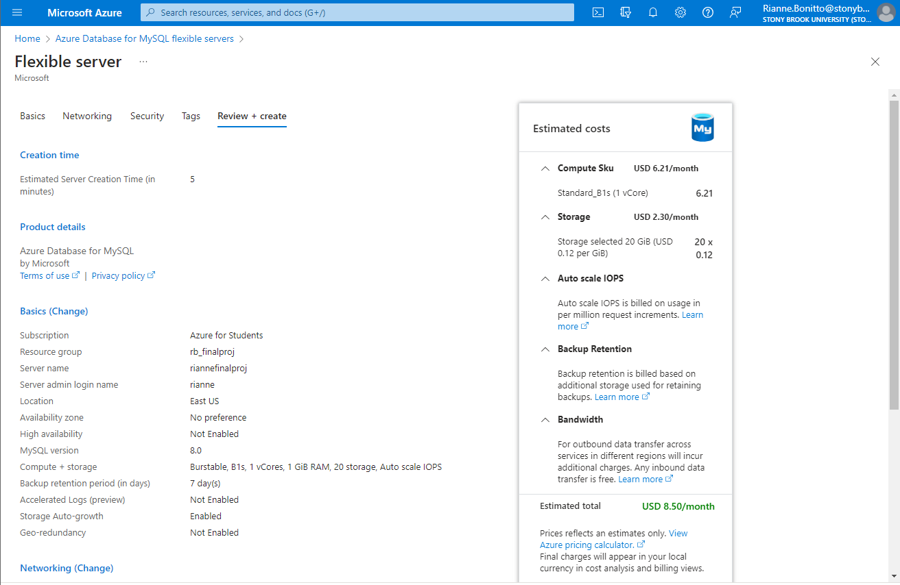   

## <b> MySQL workbench 
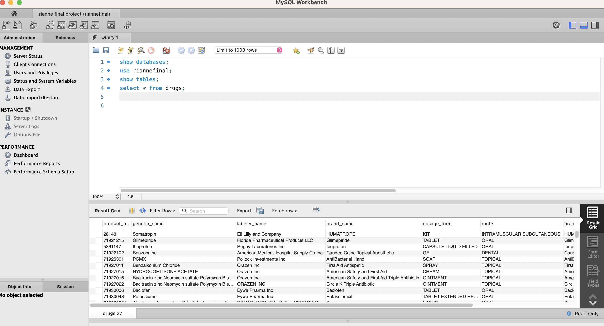   

## <b> Docker Container Deployment 
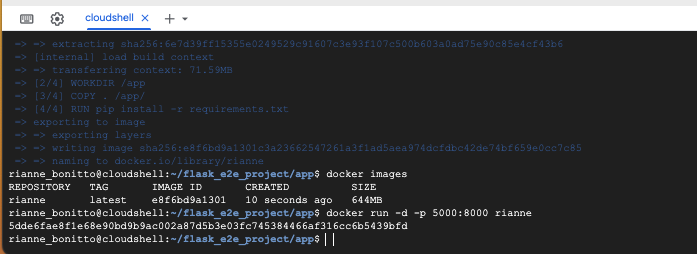
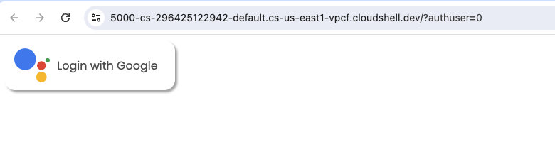   

## <b> Local Flask Deployment 
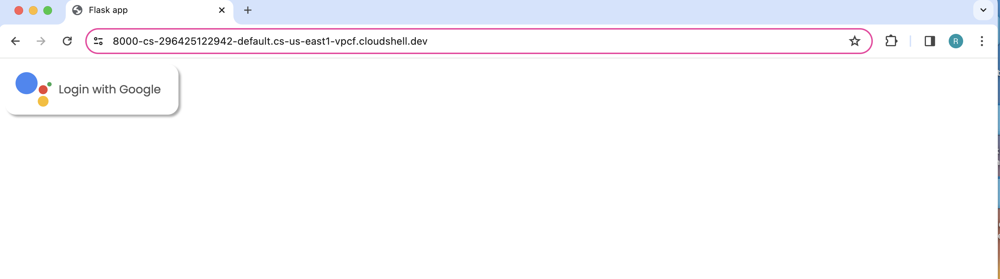
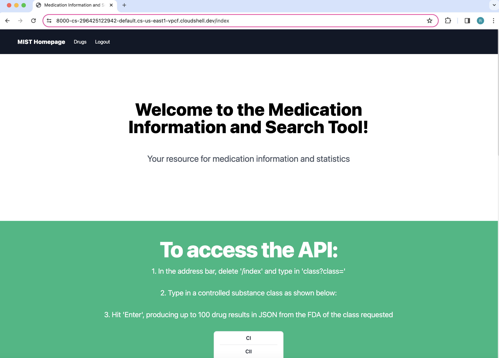
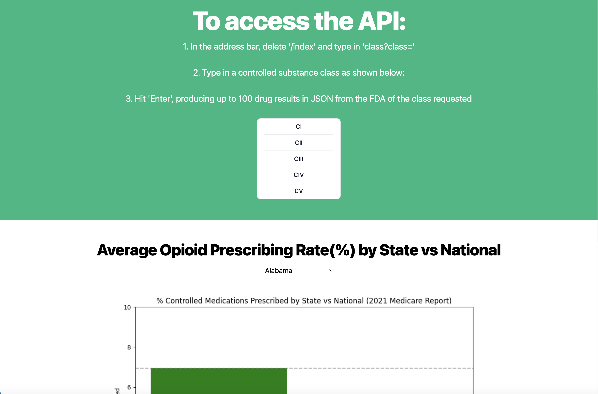
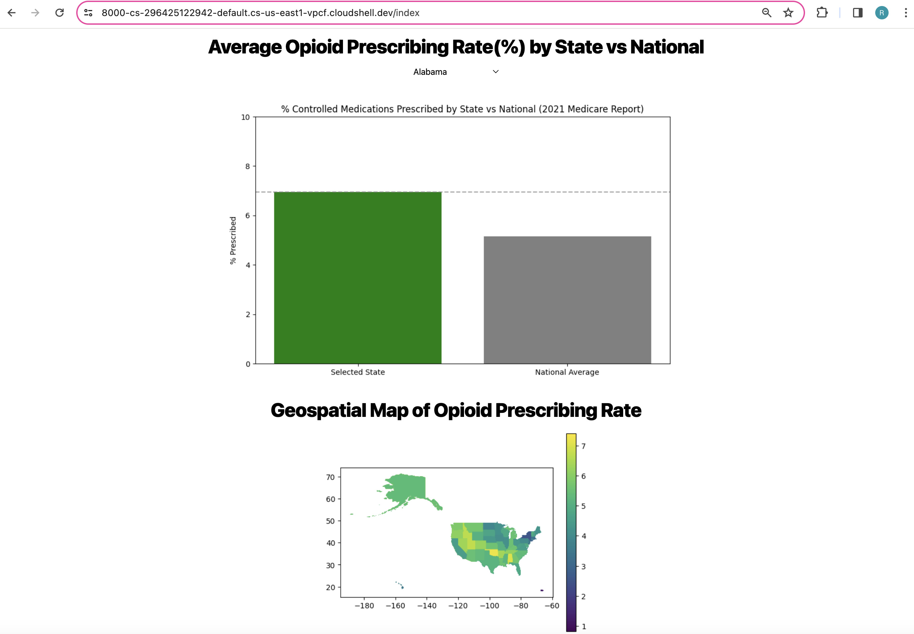
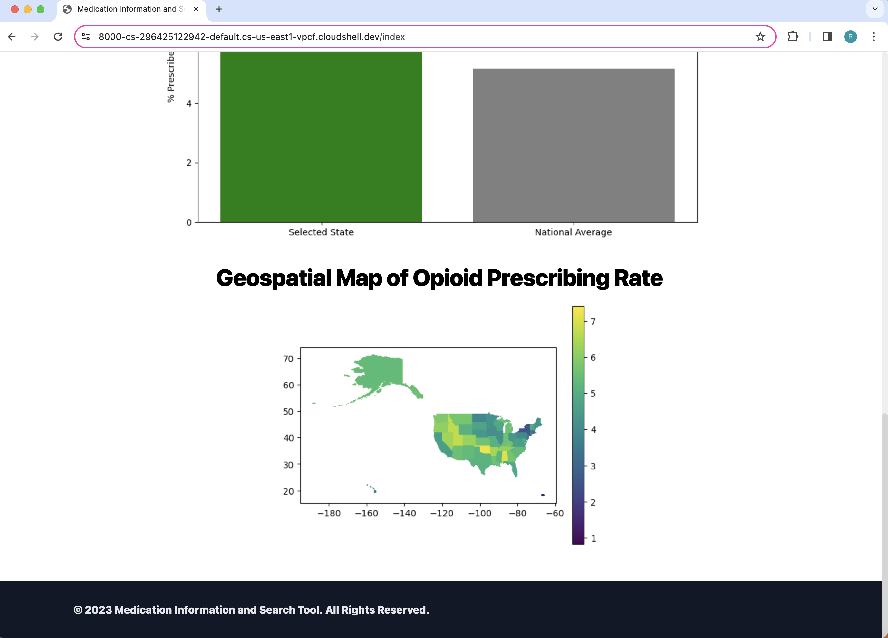
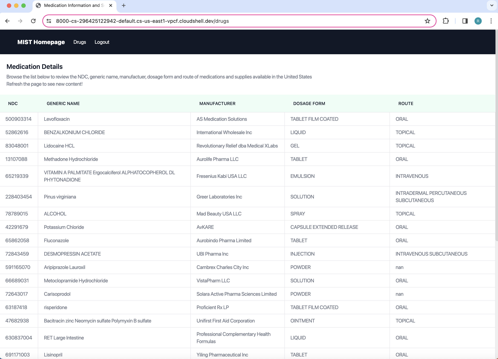
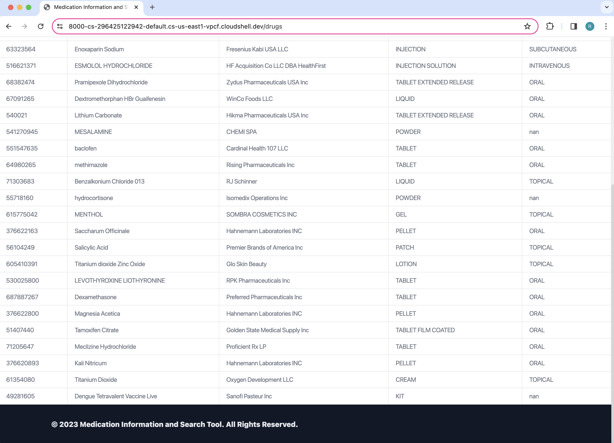
<b>API</b> 
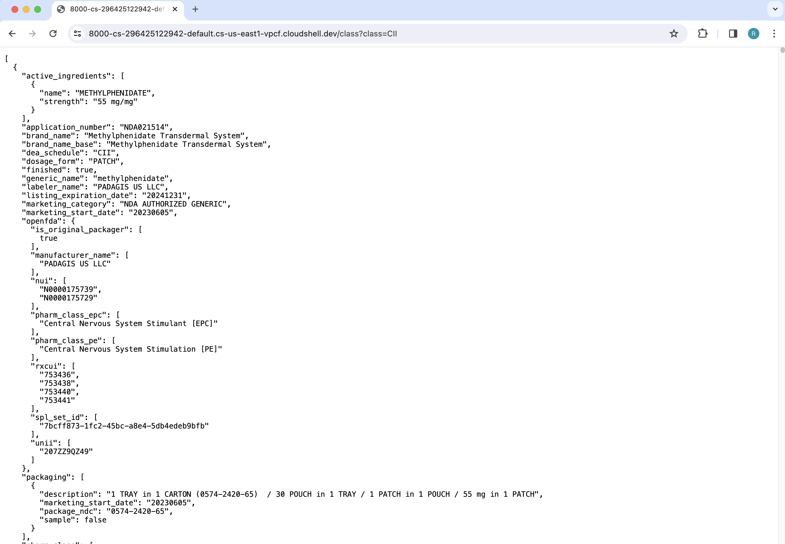   

## <b> Azure Flask Deployment  </b>
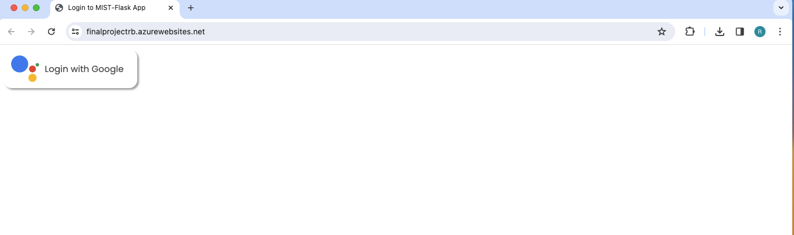
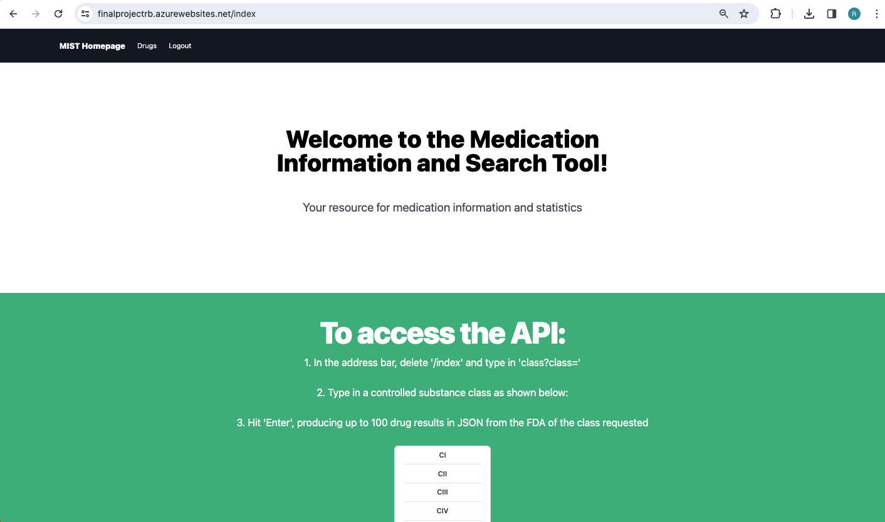
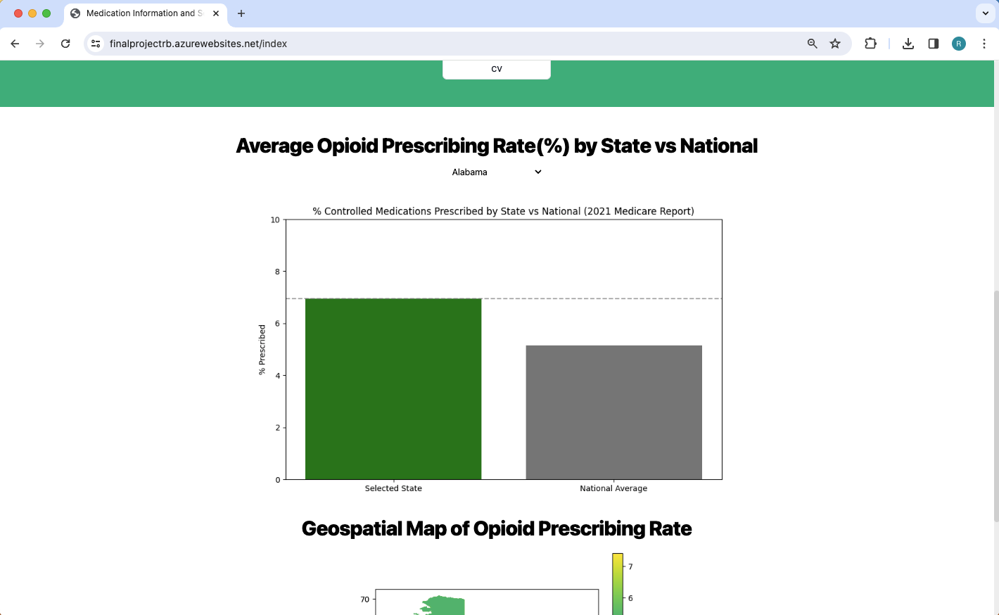
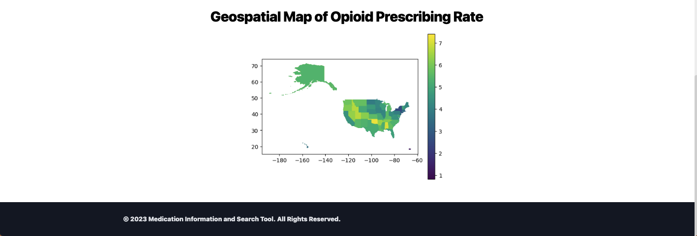
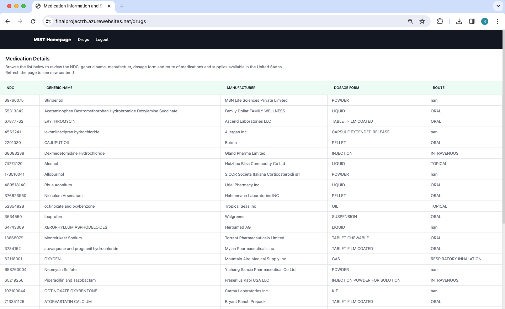
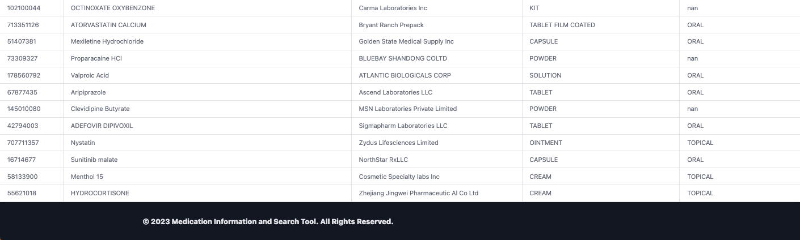

<b>API</b> 
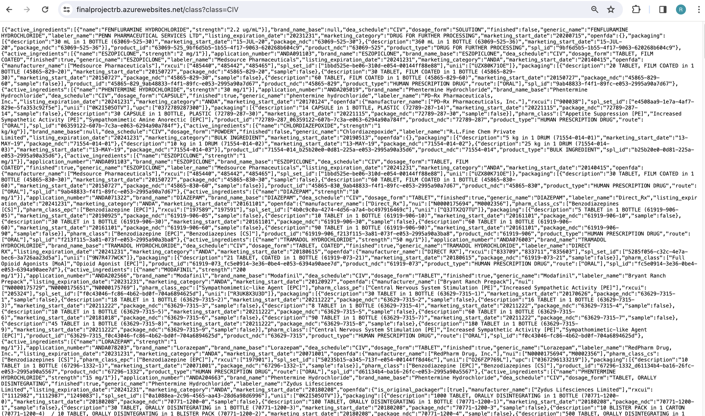